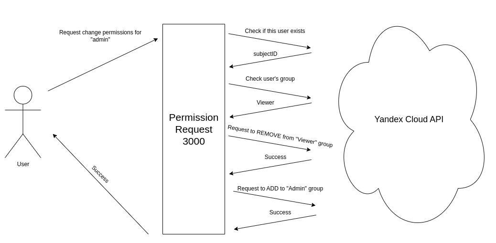

# Report

## Introduction
This report outlines the architecture, workflow, and process steps involved in the development of a system designed to change permissions on a Cloud Provider, specifically Yandex Cloud. The system includes a Dockerized web application that connects to the Yandex Cloud via its REST API to modify user permissions. Additionally, it incorporates three user groups with varying permissions levels (admin, editor, and viewer), logs stored on a Virtual Machine accessible through a specific route on a website, and a user-friendly web form. 

- [Report](#report)
  - [Introduction](#introduction)
  - [Architecture](#architecture)
    - [Main Concept](#main-concept)
    - [Access to demo](#access-to-demo)
    - [Components](#components)
    - [Security Considerations](#security-considerations)
  - [Workflow](#workflow)
    - [Workflow Development Steps](#workflow-development-steps)
    - [Proccess Workflow](#proccess-workflow)
  - [Team Roles and Contributions](#team-roles-and-contributions)
    - [Team Members and Roles](#team-members-and-roles)
  - [Video demonstration](#video-demonstration)
  - [Conclusion](#conclusion)

## Architecture

The architecture of the system primarily consists of a Flask web application serving as the backend, interacting with the Yandex Cloud's REST API to modify permissions. The backend is containerized using Docker for ease of deployment and management. Secrets and IDs required for authentication with the Yandex Cloud API are passed as environment variables, enhancing security by avoiding exposure in the client-side code.

### Main Concept

Using API of Yandex Cloud we could move user from one group to another, where permissions are already set up due to role (admin, editor and viewer)

### Access to demo

You could access the project on [this link](http://158.160.149.1). You should be added to specific Cloud Organisation. Due to problems, ask [FatM1nd](https://t.me/fatm1nd) on telegram.

### Components
1. **Flask Web Application**: Serves as the backend logic of the system, handling user requests, authentication, and interaction with the Yandex Cloud API.
2. **Docker Container**: Encapsulates the Flask application along with its dependencies, ensuring consistency and portability across different environments.
3. **Yandex Cloud API**: Provides the interface for modifying user permissions and managing resources within the Yandex Cloud infrastructure.
4. **User Groups**: Three user groups (admin, editor, and viewer) are defined with varying levels of permissions within the system.
5. **Logs on Virtual Machine**: Logs generated by the system are stored on a Virtual Machine, accessible through a specific route on a website.
6. **User-Friendly Web Form**: A web interface is provided to users for interacting with the system, offering ease of use and accessibility.

### Security Considerations
- **Backend as the Main Component**: The backend logic is prioritized over client-side operations to enhance security. This approach mitigates the risk of exposing secret tokens that could be accessed through client-side code.
- **Environment Variables for Secret Management**: Secrets and IDs required for authentication are passed as environment variables, reducing the risk of exposure compared to hardcoding them within the codebase.
- **Private Network Accessibility**: The service is designed to be accessible only within a private network to minimize unauthorized access.

## Workflow
The development workflow is structured to allow parallel work on different components of the system while ensuring seamless integration.

### Workflow Development Steps
1. **Backend Development**: The backend logic, including interaction with the Yandex Cloud API and authentication, is developed using Flask.
2. **HTML/CSS Development**: Concurrently, the frontend components, including the user-friendly web form and website layout, are developed using HTML and CSS.
3. **Integration and Testing**: Once the backend and frontend components reach a certain level of maturity, integration testing is conducted to ensure seamless communication between the different parts of the system.
4. **Deployment**: The Docker container containing the Flask application is deployed to the target environment, ensuring consistency and ease of deployment.
5. **Monitoring and Maintenance**: Regular monitoring and maintenance activities are conducted to ensure the system's stability, security, and performance.

### Proccess Workflow

## Team Roles and Contributions
The development team comprises individuals with expertise in backend development, frontend development, and system administration.

### Team Members and Roles

| Member | Role | 
--|-----------
| Nikita Semeritskiy | Backend Developer and DevOps Engineer |
| Daniyar Cherekbashev | Frontend Developer |
| Ilya Pecherskiy | Cloud developer and manager |
| Albert Avkhadeev | Backend Developer|
| Timur Kharin | API manager and flow developer |

Despite the distribution of roles in our team, everyone participated in brainstorms and offered ideas and solutions to problems

## Video demonstration
Short PoC demo of the service
https://streamable.com/rif6ar

## Conclusion
The designed system provides a secure and user-friendly solution for managing permissions on the Yandex Cloud platform. By leveraging Flask for the backend, Docker for containerization, and environment variables for secret management, the system achieves a balance between security, functionality, and ease of use. The collaborative workflow enables efficient development and integration of different components, resulting in a cohesive and reliable system architecture.
